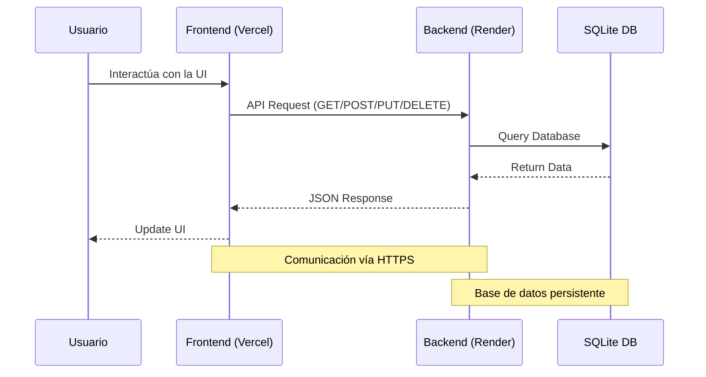

# 🚀 Sistema de Gestión de Inventario

Una aplicación completa de gestión de inventario con backend en Flask y frontend en React.

## ✨ Características

- **Backend API REST** en Flask (Python)
- **Frontend** en React con interfaz moderna
- **Base de datos SQLite** para almacenamiento local
- **Gestión completa de productos** (CRUD)
- **Búsqueda y filtros** avanzados
- **Reportes de bajo stock**
- **Estadísticas del inventario**

## 🏗️ Arquitectura del Proyecto

### 📊 Diagrama General de Arquitectura

```mermaid
graph TB
    subgraph "⚛️ FRONTEND (React)"
        A[React App] --> B[Components]
        B --> C[ProductList]
        B --> D[AddProduct]
        B --> E[EditProduct]
        B --> F[SearchProduct]
        B --> G[LowStockReport]
        
        A --> H[React Router]
        A --> I[State Management]
        A --> J[API Calls]
    end
    
    subgraph "⚙️ BACKEND (Flask)"
        K[Flask API] --> L[Routes]
        L --> M[Health Endpoint]
        L --> N[Products Endpoint]
        L --> O[Search Endpoint]
        L --> P[Statistics Endpoint]
        
        K --> Q[Database Layer]
        K --> R[CORS Middleware]
    end
    
    subgraph "🗄️ DATABASE"
        S[SQLite Database]
        S --> T[Productos Table]
        T --> U[id, nombre, descripcion, cantidad, precio, categoria]
    end
    
    subgraph "🚀 INFRASTRUCTURA"
        V[Vercel Platform]
        V --> W[Auto-deploy from Git]
        V --> X[SSL Certificate]
        V --> Y[CDN Global]
        
        Z[Render Platform]
        Z --> AA[Python Web Service]
        Z --> BB[Gunicorn Server]
        Z --> CC[SQLite Database]
    end
    
    J --> K
    Q --> S
    
    K --> Z
    
    style A fill:#61dafb
    style K fill:#3776ab
    style S fill:#003b57
    style V fill:#000000
    style Z fill:#00dc82
```



### 🔗 Flujo de Datos



### 📦 Stack Tecnológico

```mermaid
graph LR
    subgraph "📦 FRONTEND DEPENDENCIES"
        A[React 18] --> B[React DOM]
        A --> C[React Scripts]
        A --> D[Create React App]
    end
    
    subgraph "🐍 BACKEND DEPENDENCIES"
        E[Flask 2.3.3] --> F[Flask-CORS]
        E --> G[SQLite3]
        E --> H[Gunicorn]
    end
    
    subgraph "🔧 BUILD TOOLS"
        I[Node.js] --> J[npm]
        J --> K[Webpack]
        L[Python 3.8+] --> M[pip]
    end
    
    subgraph "🚀 DEPLOYMENT"
        N[Vercel CLI] --> O[Static Build]
        P[Render CLI] --> Q[Web Service]
    end
    
    style A fill:#61dafb
    style E fill:#3776ab
    style I fill:#339933
    style L fill:#3776ab
    style N fill:#000000
    style P fill:#00dc82
```



### 🏗️ **Arquitectura de Despliegue**

```mermaid
graph TB
    subgraph "🌐 USUARIO"
        U[Usuario Final]
    end
    
    subgraph "🚀 VERCEL (Frontend)"
        V[React App]
        V1[Static Files]
        V2[CDN Global]
        V3[SSL Certificate]
    end
    
    subgraph "⚙️ RENDER (Backend)"
        R[Flask API]
        R1[Gunicorn Server]
        R2[SQLite Database]
        R3[Health Checks]
    end
    
    U --> V
    V --> V1
    V1 --> V2
    V --> R
    R --> R1
    R1 --> R2
    R --> R3
    
    style U fill:#f0f0f0
    style V fill:#000000
    style R fill:#00dc82
```



## 🏗️ Estructura del Proyecto

```
inventario-app/
├── 🚀 Scripts de Inicio
│   ├── start-app.sh        # Inicia toda la aplicación
│   ├── stop-app.sh         # Detiene todos los servicios
│   ├── quick-start.sh      # Inicio rápido con PM2
│   ├── dev-start.sh        # Desarrollo básico
│   └── watchman-start.sh   # Con Watchman
├── ⚙️ Backend (Flask)
│   ├── api.py              # Servidor principal
│   ├── init_db.py          # Inicialización de BD
│   ├── requirements.txt    # Dependencias Python
│   └── Procfile            # Configuración Render
├── ⚛️ Frontend (React)
│   ├── src/                # Código fuente
│   ├── public/             # Archivos públicos
│   └── package.json        # Dependencias Node.js
├── 📁 Assets
│   ├── icons/              # Iconos de categorías y UI
│   └── images/             # Imágenes del proyecto
├── 📚 Documentación
│   ├── SCRIPTS.md          # Guía de scripts
│   ├── RENDER_SETUP.md     # Configuración Render
│   └── DEVELOPMENT.md      # Guía de desarrollo
├── 🚀 Despliegue
│   ├── render.yaml         # Configuración Render
│   ├── vercel.json         # Configuración Vercel
│   └── inventario.db       # Base de datos SQLite
└── 📦 Configuración
    ├── package.json         # Scripts npm
    └── requirements.txt     # Dependencias Python
```

## 🚀 Instalación y Uso

### Prerrequisitos
- Python 3.8+
- Node.js 16+
- npm o yarn

### 1. Clonar el repositorio
```bash
git clone <url-del-repositorio>
cd inventario-app
```

### 2. Configurar el Backend
```bash
cd backend
pip install -r requirements.txt
```

### 3. Configurar el Frontend
```bash
cd frontend
npm install
```

### 4. Hacer Scripts Ejecutables
```bash
chmod +x start-app.sh stop-app.sh
```

## 🎯 Ejecutar la Aplicación

### 🚀 **Inicio Rápido (Recomendado)**
```bash
# Iniciar toda la aplicación en un comando
npm start

# Detener toda la aplicación
npm run stop
```

### 🔧 **Inicio Manual (Desarrollo)**
```bash
# Iniciar Backend
cd backend
python3 api.py

# En otra terminal, iniciar Frontend
cd frontend
npm start
```

### 📋 **Scripts Disponibles**
- **`npm start`** - Inicia backend + frontend automáticamente
- **`npm run stop`** - Detiene todos los servicios
- **`npm run dev`** - Inicio rápido con PM2
- **`npm run dev:basic`** - Desarrollo básico
- **`npm run clean`** - Limpieza de archivos temporales

### 🌐 **URLs de Acceso**
- **Frontend**: http://localhost:3000
- **Backend**: http://localhost:5001
- **Health Check**: http://localhost:5001/api/health

## 📚 API Endpoints

### 🔍 **Endpoints Principales**
- `GET /api/health` - Estado de la API
- `GET /api/products` - Listar todos los productos
- `GET /api/products/<id>` - Obtener producto por ID
- `POST /api/products` - Crear nuevo producto
- `PUT /api/products/<id>` - Actualizar producto existente
- `DELETE /api/products/<id>` - Eliminar producto

### 🔎 **Endpoints de Búsqueda y Reportes**
- `GET /api/products/search?q=<term>&by=<field>` - Búsqueda avanzada
- `GET /api/products/low-stock?threshold=<num>` - Productos con bajo stock
- `GET /api/statistics` - Estadísticas del inventario

### 📊 **Ejemplos de Uso**
```bash
# Verificar estado de la API
curl http://localhost:5001/api/health

# Obtener todos los productos
curl http://localhost:5001/api/products

# Buscar productos por nombre
curl "http://localhost:5001/api/products/search?q=laptop&by=nombre"

# Productos con stock menor a 10
curl "http://localhost:5001/api/products/low-stock?threshold=10"
```

## 🛠️ Tecnologías Utilizadas

### ⚙️ **Backend**
- **Framework**: Flask 2.3.3
- **Base de Datos**: SQLite3
- **Servidor WSGI**: Gunicorn
- **CORS**: Flask-CORS
- **Lenguaje**: Python 3.8+

### ⚛️ **Frontend**
- **Framework**: React 18
- **Build Tool**: Create React App
- **Routing**: React Router DOM
- **HTTP Client**: Axios
- **Lenguaje**: JavaScript ES6+

### 🚀 **Despliegue**
- **Frontend**: Vercel (Static Hosting)
- **Backend**: Render (Web Service)
- **Base de Datos**: SQLite (Persistente)

### 🔧 **Herramientas de Desarrollo**
- **Gestión de Paquetes**: npm, pip
- **Control de Versiones**: Git
- **Scripts**: Bash (macOS/Linux)
- **Monitoreo**: PM2 (opcional)

## 🌐 Despliegue en Producción

### 🚀 **Frontend (Vercel)**
La aplicación frontend está desplegada en **Vercel** y es accesible en:
**https://inventario-188gwmekm-yohaoros-projects.vercel.app/**

#### Características del Frontend:
- ✅ **Despliegue automático** desde GitHub
- ✅ **SSL gratuito** incluido
- ✅ **CDN global** para mejor rendimiento
- ✅ **Build optimizado** para producción

### ⚙️ **Backend (Render)**
La API backend está desplegada en **Render** como servicio web:
**https://inventario-app-backend-4cnh.onrender.com/**

#### Características del Backend:
- ✅ **Servicio web Python** con Gunicorn
- ✅ **Base de datos SQLite** persistente
- ✅ **Health checks** automáticos
- ✅ **Auto-suspensión** para ahorrar recursos
- ✅ **Reactivación automática** en ~1 minuto

### 🔄 **Arquitectura de Despliegue**
```
┌─────────────────┐    ┌─────────────────┐    ┌─────────────────┐
│   🌐 Usuario    │───▶│  ⚛️ Vercel      │───▶│  ⚙️ Render      │
│                 │    │  (Frontend)     │    │  (Backend)      │
└─────────────────┘    └─────────────────┘    └─────────────────┘
```

### 📊 **Ventajas de esta Arquitectura:**
- **Escalabilidad**: Frontend y backend independientes
- **Costos**: Planes gratuitos en ambas plataformas
- **Rendimiento**: CDN global + servicio web dedicado
- **Mantenimiento**: Despliegues independientes

## 📝 Licencia

Este proyecto está bajo la **Licencia MIT**. Ver archivo [LICENSE](LICENSE) para más detalles.

### ¿Qué significa la Licencia MIT?

La Licencia MIT es una licencia de software **muy permisiva** que permite:

- ✅ **Usar** el código para cualquier propósito
- ✅ **Modificar** el código como quieras  
- ✅ **Distribuir** el código modificado
- ✅ **Usar comercialmente** (vender, usar en empresas)
- ✅ **Integrar** en software propietario

**Solo requiere:** Mantener el aviso de copyright original.

### Texto Completo de la Licencia MIT

```
MIT License

Copyright (c) 2024 YohaOro

Permission is hereby granted, free of charge, to any person obtaining a copy
of this software and associated documentation files (the "Software"), to deal
in the Software without restriction, including without limitation the rights
to use, copy, modify, merge, publish, distribute, sublicense, and/or sell
copies of the Software, and to permit persons to whom the Software is
furnished to do so, subject to the following conditions:

The above copyright notice and this permission notice shall be included in all
copies or substantial portions of the Software.

THE SOFTWARE IS PROVIDED "AS IS", WITHOUT WARRANTY OF ANY KIND, EXPRESS OR
IMPLIED, INCLUDING BUT NOT LIMITED TO THE WARRANTIES OF MERCHANTABILITY,
FITNESS FOR A PARTICULAR PURPOSE AND NONINFRINGEMENT. IN NO EVENT SHALL THE
AUTHORS OR COPYRIGHT HOLDERS BE LIABLE FOR ANY DAMAGES OR OTHER LIABILITY,
WHETHER IN AN ACTION OF CONTRACT, TORT OR OTHERWISE, ARISING FROM, OUT OF
OR IN CONNECTION WITH THE SOFTWARE OR THE USE OR OTHER DEALINGS IN THE
SOFTWARE.
```

## 📖 **Documentación Adicional**

### 📚 **Guías Detalladas**
- **[SCRIPTS.md](SCRIPTS.md)** - Guía completa de todos los scripts disponibles
- **[RENDER_SETUP.md](RENDER_SETUP.md)** - Configuración paso a paso para Render
- **[DEVELOPMENT.md](DEVELOPMENT.md)** - Guía de desarrollo y contribución

### 🚀 **Scripts Principales**
- **`start-app.sh`** - Inicia toda la aplicación en un comando
- **`stop-app.sh`** - Detiene todos los servicios limpiamente
- **`quick-start.sh`** - Inicio rápido con PM2 para desarrollo avanzado

### 🔧 **Comandos NPM Disponibles**
```bash
npm start          # Inicia aplicación completa
npm run stop       # Detiene todos los servicios
npm run dev        # Inicio rápido con PM2
npm run clean      # Limpieza de archivos temporales
```

---

**¿Te gusta este proyecto?** ⭐ ¡Dale una estrella en GitHub! 