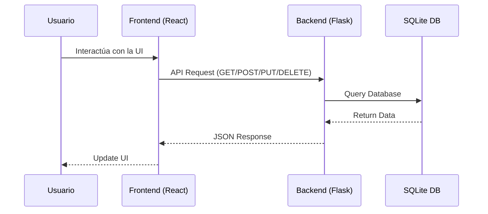
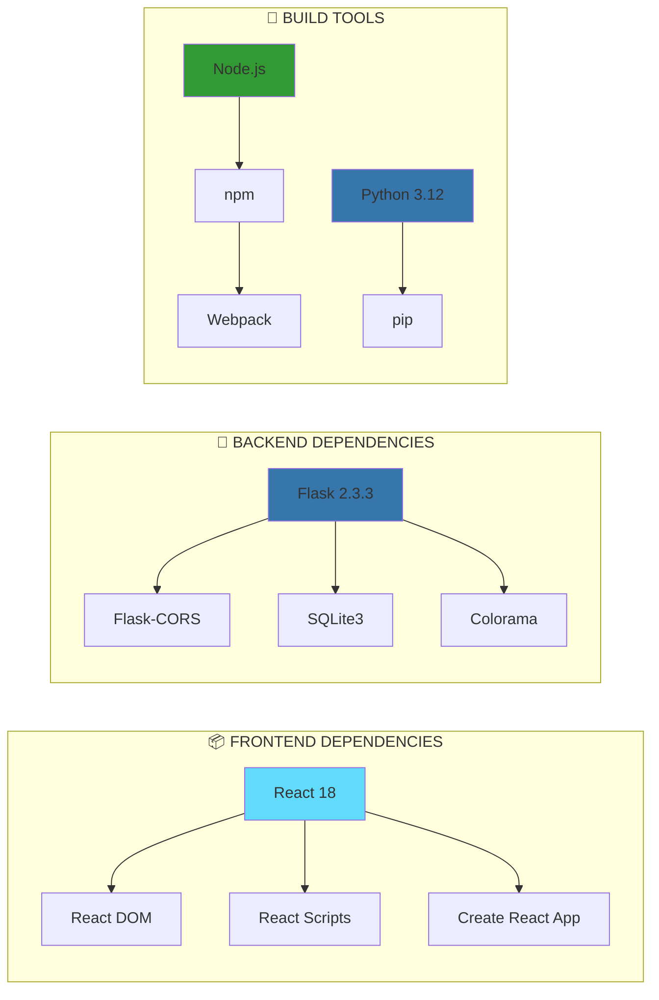

# 🚀 Sistema de Gestión de Inventario

Una aplicación completa de gestión de inventario con backend en Flask y frontend en React.

## ✨ Características

- **Backend API REST** en Flask (Python)
- **Frontend** en React con interfaz moderna
- **Base de datos SQLite** para almacenamiento local
- **Gestión completa de productos** (CRUD)
- **Búsqueda y filtros** avanzados
- **Reportes de bajo stock**
- **Estadísticas del inventario**

## 🏗️ Arquitectura del Proyecto

### 📊 Diagrama General de Arquitectura

```mermaid
graph TB
    subgraph "⚛️ FRONTEND (React)"
        A[React App] --> B[Components]
        B --> C[ProductList]
        B --> D[AddProduct]
        B --> E[EditProduct]
        B --> F[SearchProduct]
        B --> G[LowStockReport]
        
        A --> H[React Router]
        A --> I[State Management]
        A --> J[API Calls]
    end
    
    subgraph "⚙️ BACKEND (Flask)"
        K[Flask API] --> L[Routes]
        L --> M[Health Endpoint]
        L --> N[Products Endpoint]
        L --> O[Search Endpoint]
        L --> P[Statistics Endpoint]
        
        K --> Q[Database Layer]
        K --> R[CORS Middleware]
    end
    
    subgraph "🗄️ DATABASE"
        S[SQLite Database]
        S --> T[Productos Table]
        T --> U[id, nombre, descripcion, cantidad, precio, categoria]
    end
    
    subgraph "🚀 INFRASTRUCTURA"
        V[Vercel Platform]
        V --> W[Auto-deploy from Git]
        V --> X[SSL Certificate]
        V --> Y[CDN Global]
    end
    
    J --> K
    Q --> S
    
    style A fill:#61dafb
    style K fill:#3776ab
    style S fill:#003b57
    style V fill:#000000
```



### 🔗 Flujo de Datos



### 📦 Stack Tecnológico



## 🏗️ Estructura del Proyecto

```
inventario-app/
├── backend/                 # API Flask
│   ├── api.py              # Servidor principal
│   ├── init_db.py          # Inicialización de BD
│   ├── run_server.sh       # Script de inicio
│   └── requirements.txt    # Dependencias Python
├── frontend/               # Aplicación React
│   ├── src/                # Código fuente
│   ├── public/             # Archivos públicos
│   └── package.json        # Dependencias Node.js
└── inventario.db           # Base de datos SQLite
```

## 🚀 Instalación y Uso

### Prerrequisitos
- Python 3.8+
- Node.js 16+
- npm o yarn

### 1. Clonar el repositorio
```bash
git clone <url-del-repositorio>
cd inventario-app
```

### 2. Configurar el Backend
```bash
cd backend
pip install -r requirements.txt
```

### 3. Configurar el Frontend
```bash
cd frontend
npm install
```

## 🎯 Ejecutar la Aplicación

### Iniciar el Backend
```bash
cd backend
./run_server.sh
```
El servidor estará disponible en: http://localhost:5001

### Iniciar el Frontend
```bash
cd frontend
npm start
```
La aplicación estará disponible en: http://localhost:3000

## 📚 API Endpoints

- `GET /api/health` - Estado de la API
- `GET /api/products` - Listar productos
- `POST /api/products` - Crear producto
- `PUT /api/products/<id>` - Actualizar producto
- `DELETE /api/products/<id>` - Eliminar producto
- `GET /api/products/search` - Buscar productos
- `GET /api/statistics` - Estadísticas del inventario

## 🛠️ Tecnologías Utilizadas

- **Backend:** Flask, SQLite, Python
- **Frontend:** React, JavaScript, CSS
- **Base de Datos:** SQLite
- **APIs:** RESTful API

## 🌐 Despliegue en Producción

La aplicación está desplegada en **Vercel** y es accesible en:
**https://inventario-app-git-deploy-yohaoros-projects.vercel.app/**

### Características del Despliegue:
- ✅ **Despliegue automático** desde GitHub
- ✅ **SSL gratuito** incluido
- ✅ **CDN global** para mejor rendimiento
- ✅ **Base de datos SQLite** integrada
- ✅ **API REST** completamente funcional

## 📝 Licencia

Este proyecto está bajo la Licencia MIT. 